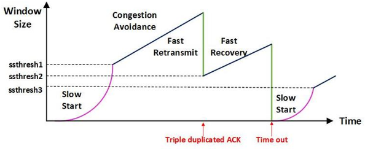
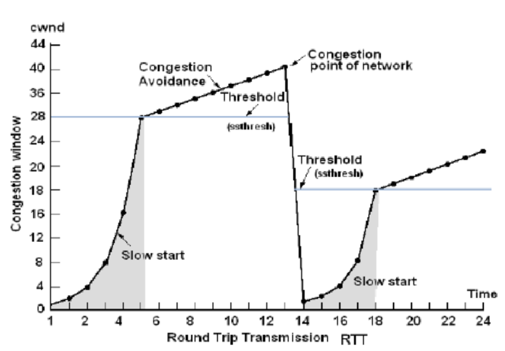

## **흐름제어** (endsystem 대 endsystem)

- **송신측 속도 > 수신측 속도**일 경우 수신자가 데이터를 받을 때 오버플로우가 발생할 수 있다.
- 저장 용량을 초과한 이후에 도착하는 데이터는 손실 될 수 있으며, 만약 손실 된다면 불필요하게 응답과 데이터 전송이 송/수신 측 간에 빈번이 발생한다.
- 데이터 처리 속도를 제어하여 데이터 전송량을 수신측에 따라 조절해야한다.
- 기본 개념은 receiver가 sender에게 현재 자신의 상태를 feedback 한다는 점

### **해결 방법**

- **Stop and Wait**
    - 매번 전송한 패킷에 대해 확인 응답을 받아야만 그 다음 패킷을 전송하는 방법
- **Sliding Window** (Go Back N ARQ) → Stop And Wait 개선.
    - 수신측에서 설정한 윈도우 크기만큼 송신측에서 확인응답없이 세그먼트를 전송할 수 있게 하여 데이터 흐름을 동적으로 조절하는 제어기법
    - 송신측에서는 Ack 프레임을 수신하지 않더라도 여러 개의 프레임을 연속적으로 전송할 수 있다.
    - **동작방식** : 먼저 윈도우에 포함되는 모든 패킷을 전송하고, 그 패킷들의 전달이 확인되는대로 이 윈도우를 옆으로 옮김으로써 그 다음 패킷들을 전송
    - **윈도우** : 송신, 수신 스테이션 양쪽에서 만들어진 버퍼의 크기.

## **혼잡제어**

- 혼잡 : 네트워크 내에 패킷의 수가 과도하게 증가하는 현상
    - 한 라우터에 데이터가 몰림 → 처리 X → 재전송 → 혼잡 가중 → 다시 손실
- 혼잡 제어 : 혼잡 현상을 방지하거나 제거하는 기능
    - 송신측에서 보내는 데이터의 전송 속도(=네트워크 내의 데이터 양)를 강제로 줄임.
- 흐름제어가 송신측과 수신측 사이의 전송속도를 다루는데 반해, 혼잡제어는 호스트와 라우터를포함한 보다 넓은 관점에서 전송 문제를 다루게 된다.
  

### **해결방법**

- **AIMD(Additive Increase / Multiplicative Decrease)**
    - 처음에 패킷 하나씩 → 이것이 문제없이 도착하면 window 크기(단위 시간 내에 보내는 패킷의 수)를 1씩 증가시켜가며 전송하는 방법
    - 패킷 전송 실패 / 일정 시간을 넘으면(time out) 패킷 보내는 속도를 절반으로 줄임
    - 공평한 방식으로, 여러 호스트가 한 네트워크를 공유하고 있으면 나중에 진입하는 쪽이 처음에는 불리하지만, 시간이 흐르면 평형상태로 수렴하게 되는 특징이 있다.
    - 문제점
        - 초기에 네트워크의 높은 대역폭을 사용하지 못하여 오랜 시간이 걸림
        - 네트워크가 혼잡해지는 상황을 미리 감지하지 못함 ( = 네트워크가 혼잡해지고 나서야 대역폭을 줄임)
- **Slow Start (느린 시작)**
    - AIMD와 마찬가지로 패킷을 하나씩 보내면서 시작하고, 패킷이 문제없이 도착하면 각각의 ACK 패킷마다 window size를 1씩 늘려준다. 즉, 한 주기가 지나면 window size가 2배로 된다.
    - 전송속도는 AIMD에 반해 지수 함수 꼴로 증가. 대신에 혼잡 현상이 발생하면 window size를 1로 떨어뜨리게 된다.
    - 처음에는 네트워크의 수용량을 예상할 수 있는 정보가 없지만, 한번 혼잡 현상이 발생하고 나면 네트워크의 수용량을 어느 정도 예상할 수 있다.
    - 그러므로 혼잡 현상이 발생하였던 window size의 절반까지는 이전처럼 지수 함수 꼴로 창 크기를 증가시키고 그 이후부터는 완만하게 1씩 증가시킨다.
      

- **Congestion Avoidance (혼잡 회피)**
    - 윈도우의 크기가 임계 값에 도달한 이후에는 데이터의 손실이 발생할 확률이 높아짐
    - 이를 회피하기 위해 **윈도우 크기를 선형적으로 1씩 증가시키는 방법**이다.
    - 수신측으로부터 일정 시간 동안까지 ACK를 수신하지 못하는 경우.
        - 타임 아웃의 발생 : 네트워크 혼잡이 발생했다고 인식.
        - 혼잡 상태로 인식된 경우
            - 윈도우의 크기를 즉, 세그먼트의 수를 1로 감소시킨다.
            - 동시에 임계값을 패킷 손실이 발생했을 때의 윈도우 크기의 절반으로 줄인다.
- **Fast Retransmit (빠른 재전송)**
    - TCP의 혼잡 조절에 추가된 정책이다.
    - 패킷을 받는 쪽에서 먼저 도착해야할 패킷이 도착하지 않고 다음 패킷이 도착한 경우에도 ACK 패킷을 보내게 된다.
    - 단, 순서대로 잘 도착한 마지막 패킷의 다음 패킷의 순번을 ACK 패킷에 실어서 보내게 되므로, 중간에 하나가 손실되게 되면 송신 측에서는 순번이 중복된 ACK 패킷을 받게 된다. 이것을 감지하는 순간
      문제가 되는 순번의 패킷을 재전송 해줄 수 있다.
    - 중복된 순번의 패킷을 3개 받으면 재전송을 하게 된다. 약간 혼잡한 상황이 일어난 것이므로 혼잡을 감지하고 window size를 줄이게 된다.
- **Fast Recovery (빠른 회복)**
    - 혼잡한 상태가 되면 window size를 1로 줄이지 않고 반으로 줄이고 선형증가시키는 방법
    - 이 정책까지 적용하면 혼잡 상황을 한번 겪고 나서부터는 순수한 AIMD 방식으로 동작하게 된다.

### 질문

- TCP/IP 혼잡 제어 기법이 왜 사용되나요?
    - 송신 측에서 보내는 데이터의 양이 라우터가 처리할 수 있는 양을 초과하면 초과된 데이터는 라우터가 처리하지 못하게 됩니다. 송신 측은 초과된 데이터를 손실 데이터로 간주하고 계속 재전송을 하여 네트워크를
      혼잡하게 합니다. 이런 상황을 예방하기 위해 송신 측의 전송 속도를 적절히 조절하는 혼잡 제어 기법이 사용됩니다.
- TCP/IP 통신에서 흐름 제어 기법이 왜 사용되나요?
    - 송 수신자 간의 TCP 버퍼의 크기 차이로 인해 생기는 데이터 처리 속도 차이를 해결하기 위해 사용됩니다.