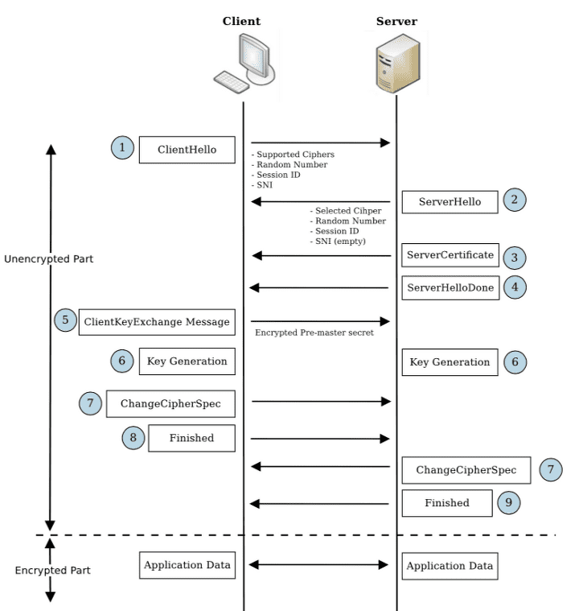

# TLS/SSL HandShake

> 클라이언트 - 서버간 HTTPS 통신 전, SSL 인증서를 통한 신뢰성 여부 판단을 위해 거치는 과정

### reference

- [https에 대해서 | Kyun2da.dev](https://kyun2da.dev/CS/https%EC%97%90-%EB%8C%80%ED%95%B4%EC%84%9C/)
- [REAKWON :: [네트워크/보안] TLS(SSL) 개념과 기본 동작 원리 (tistory.com)](https://reakwon.tistory.com/106)
- [[네트워크] TLS & SSL Handshake (tistory.com)](https://steady-coding.tistory.com/512)

1. 클라이언트 `Client Hello` → 서버
   - SSL(TLS) 버전
   - [암호 스위트](https://rsec.kr/?p=455)
   - 32바이트 난수값
   - session ID 등
2. 서버 `Server Hello` → 클라이언트
   - SSL(TLS) 버전
   - client의 암호 스위트 중 선택한 한 개 등
3. 서버 `Certificate` → 클라이언트
   - CA 공개 인증서(SSL 인증서) 포함
4. 클라이언트는 서버의 CA 인증서가 유효한지 CA 목록에서 확인 → CA 인증서 신뢰성 확보
   - 브라우저에 내장된 CA의 공개키로 복호화하여 성공하면 CA가 서명한 것이 맞으니 진짜라고 판단
5. 클라이언트 `Client Key Exchange` → 서버
   - SSL 인증서에서 추출한 서버의 공개키로 암호화한 대칭키 생성하여 전달 (실제 데이터 암호화에 사용)
6. 서버는 암호화된 대칭키를 서버 개인키로 복호화
7. 서버 `Server Hello Done` → 클라이언트
8. 클라이언트 `finished` → 서버
   - 지금까지의 교환 내역 해싱 + 대칭키로 암호화하여 함께 보냄
9. 서버에서도 교환 내용들을 해싱하여 클라이언트가 보낸 값과 일치하는지 확인
10. 서버 `finished` → 클라이언트
    - 생성한 대칭키로 암호화하여 전송
11. 클라이언트는 서버의 `finished`를 대칭키로 복호화하여 신뢰받은 사용자라는 것을 인지 → 앞으로 해당 대칭키로 통신

---

### 예상 질문

- Q. SSL Handshake는 왜 하나요?
  - A. 클라이언트와 서버가 서로 신분을 확인하고, 대칭키 생성에 필요한 정보를 주고받기 위해 수행합니다.

