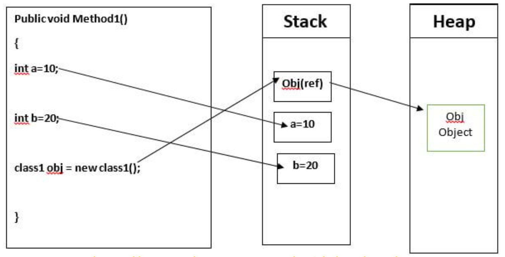
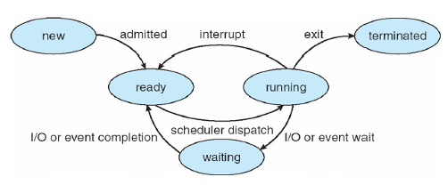

# 프로세스 (Process)
## 1. Process란?

- 프로세스는 코드로 작성된 프로그램이 메모리에 적재되어 사용할 수 있는 상태가 된 것이다. 즉, 메모리 상에서 실행중인 프로그램을 프로세스라고 한다.
- 여러개의 Thread를 보관하고 있는 컨테이너이다.
- 프로세스는 최소한 한개 이상의 Thread를 보관한다. (생성될 때 기본적으로 하나의 스레드를 같이 생성한다.)

## 2. 프로세스의 주소 공간

- **Text (Code)**: 코드 자체를 구성하는 메모리 영역
- **Data**:  전역변수, 정적 변수, 배열과 같은 static data (global variable)
    - 초기화된 데이터는 data 영역에 저장하며 초기화되지 않은 데이터는 bss 영역에 저장한다.
- **Stack**: 지역변수, 매개변수, 리턴 값과 같은 데이터를 저장하는 임시 메모리 영역이다. (local variable, function parameter, return address)
- **Heap**: run time 시점에 동적 할당되는 데이터들이 저장된다. (malloc, java object)

  > C에서 Pointer 변수 같은 경우 stack에는 데이터의 주소값들이 저장이 되고 heap에는 실제 값이 저장된다.
  >

  > Java의 경우 객체 생성에서 비슷한 예시가 있다.
  >
  >
  > 
  >
  > int a,b는 local variable이어서 stack에 저장이 되고 class1 obj도 local variable이어서 stack에 저장이 되는데 object의 실제 내용은 heap에 저장이 되고 stack에서는 주소값을 갖고 있다. object를 생성이 되면 처음에는 stack에 주소값만 생성이 되고 실제로 할당이 되면 그때서야 heap이 생성되고 실제 데이터가 저장이 된다.
>

프로세스는 위와 같은 자신만의 공간과 자원을 할당받아 사용을 한다. 그에 반하여 스레드는 스택만 따로 할당받고 나머지 영역은 프로세스 안에서 다른 스레드와 공간과 자원을 공유하며 사용한다.

### 2.1. 프로세스 주소 공간을 나눈 이유는 무엇일까?

최대한 데이터를 공유하며 메모리 사용량을 줄이기 떄문이다.

Code와 같은 프로그램 자체의 정보는 같은 변함이 없는 같은 내용이기에 따로 관리를 하며 공유를 한다. 반면에 Stack, Data는 스택의 구조의 특성과 전역 변수의 활용성을 위해서 나누게 되었다.

## 3. 프로세스의 상태

- **Running**: CPU를 잡고 instruction을 수행중인 상태
- **Ready**: CPU를 사용하려고 기다리는 상태 (할당이 되면 바로 시행하려고 proces 가 메모리에 올라가 있다.)
- **Blocked(wait, sleep)**: CPU를 주어도 당장 instruction을 수행할 수 없는 상태, process 자신이 요청한 event (I/O, 공유하는 데이터 등)가 즉시 만족되지 않아 이를 기다리는 상태이다. 요청한 event가 수행을 마치면 interrupt를 발생시키고 blocked상태의 process를 ready queue에 옮겨준다.
- **New**: process가 생성중인 상태
- **Terminated**: 수행이 끝난 상태

> running state에서 CPU를 뺐기거나 넘기는 경우
>
> 1. Interrupt가 발생했을 때 (timer도 포함)
> 2. I/O request를 하기 위해 system call을 하여 waiting상태로 넘어가는 경우
> 3. Process의 수행이 끝나서 terminated로 되는 경우

## 3. PCB란?

각각의 Process들은 OS의 관리를 받게 되는데 이때 OS는 process의 현재 정보들을 알기 위해 PCB를 사용한다.

[PCB(Process Control Block) ](https://www.notion.so/PCB-Process-Control-Block-03d73381c913429baad7bbe7623b0720)

## 4. Process Context

Process Context는 프로세스의 상태를 나타낸다. 현재 이 프로세스가 메모리를 얼마나 사용하고 있는지? 함수를 어디까지 실행하고 있는지? 과거에 나쁜 짓을 하지 않았는지? 등의 정보를 갖고 있다.

- CPU execution context
    - process counter
    - registers
- Process memory space
    - code, data, stack
- Process management inOS
    - Process Control Block (PCB)
    - Kernel stack

## 5. 멀티 프로세스

컴퓨터에 있는 하나 이상의 CPU에서 하나 이상의 작업을 동시에 병렬처리하는 것을 의미한다.

**장점**

- 독립된 구조로 안정성이 높다.
- 프로세스 중에 하나에 문제가 생겨도 다른 프로세스에 영향을 주지 않아 정지되는 문제가 발생하지 않는다.

**단점**

- 독립된 메모리 영역이기 때문에 작업이 많을 수록 Context Switching Overhead가 발생하여 성능 저하가 발생할 수 있다.
- 각각의 프로세스가 PCB, OS resource를 가져서 효율적이지 못하다.
- 프로세스끼리 서로 데이터를 공유하려면 IPC를 필요로 한다.

## 6. IPC

[IPC (Inter Process Communication)](https://www.notion.so/IPC-Inter-Process-Communication-4afdffc4d2c343c38005649917870f41)
