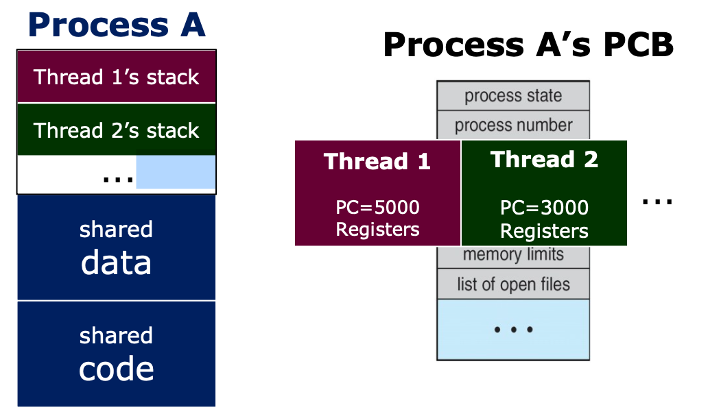
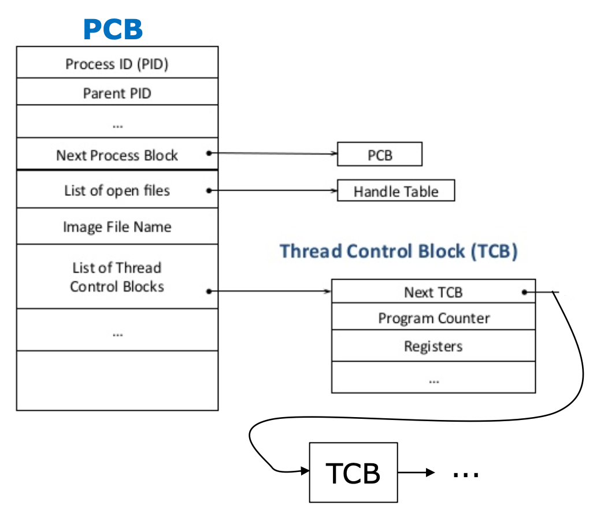

# Thread
## 1. Thread란?

CPU가 동작하는 가장 작은 단위의 unit은 thread이다.
사용자들이 2개의 같은 program을 이용하는 경우는 program들은 동일한 code를 실행하고 data들을 공유하고 싶을 것이다. 그래서 code와 data를 같이 공유하며 사용하자라고 만든 것이 thread이다

- 동일한 프로그램을 여러 개 띄우더라도 process가 하나만 만들어진다. (code, data, stack이 하나만 만들어진다는 뜻.)
- thread마다 PC, register, stack를 따로 관리 (TCB)
- thread들은 code, data, OS resources를 공유한다. (공유하는 부분을 task라고 부른다.)
- IPC없이 바로 shared memory에 접근 가능하다
- Process들끼리 바꾸는 context switching보다 Thread를 변경하는 것이 overhead가 적다.
- 새로운 스레드를 만들 때는 PC, Register, Stack에 대한 공간만 만들면 됨으로 프로세스를 만드는 것보다 memory와 time 측면에서 이점이 있다.

## 2. Thread의 종류

스레드는 Kernel Thread와 User Thread로 나뉜다.

### 2.1. Kernel thread

- thread_create system call을 통해 생성되며 Kernel의 support를 받아 kernel이 thread의 존재를 알게 된다.
- 각각의 thread는 TCB를 갖는다. (TCB의 정보들은 PCB안에 있다.)
- **장점**: Parallelism과 Concurrency를 지원한다.

  (Concurrency: 하나의 스레드가 block 상태에 있어도 다른 스레드가 실행 가능하다.)

- **단점**: thread들은 kernel을 통해서 operation을 해야하기에 User thread보다 무겁다.

### 2.2. User thread

- Implement thread in user library.
- 생성을 위해 system call이 필요 없다.
- 하나의 kernel thread안에 여러 개의 user thread가 mapping되어서 만들어진다.
- **장점**: kernel이 존재를 몰라서 user space안에서 thread library에 의해 관리된다, system call이 필요 없어서 빠르다.
- **단점**: 하나의 user thread가 system call을 만들면 전체 thread가 blocked 상태가 된다 또한 Parallelism을 지원하지 않는다.

## 3. TCB (Thread Control Block)

- process를 관리하기 위해 필요한 PCB와 같이 thread를 관리하기 위해서는 TCB가 있다.
- TCB의 정보는 PCB안에 있다.
- 각각의 Kernel Thread에만 생성된다.
- Contains PC, register의 정보를 갖고 있다.
- ready queue는 CPU를 기다리고 있는 TCB의 리스트로 context switch를 할때마다 TCB들에 있는 각각의 PC, register 정보를 바꿔주게 된다.

## 4. 멀티 스레드

하나의 프로세스에 여러 스레드로 자원을 공유하며 작업을 나누어 수행하는 것이다.

**장점**

- 독립적으로 프로세스를 생성하는 것에 비해 PC, Register, Stack에 대한 공간만 만들면 됨으로 프로세스를 만드는 것보다 memory와 time 측면에서 이점이 있다.
- 시스템의 처리율이 향상된다.
- 스레드간 데이터를 주고받는 것이 간단해지고 시스템 자원 소모가 줄었다.
- 스레드 사이의 작업량이 적어 Context Switching이 빠르다. (캐시 메모리를 비울 필요가 없다)
    - Nom-blocking system call을 하여 효율적이다.
        - Single thread는 I/O작업을 하면 process전체가 waiting으로 가게 되는 blocking system인데 multi-thread process같은 경우는 하나의 thread가 I/O작업을 하여 해당 thread가 waiting으로 가더라도 다른 thread가 CPU를 할당받아 사용할 수 있는 Non-blocking system이다.
- 간단한 통신 방법으로 프로그램의 응답시간과 통신 비용이 단축됐다. (IPC없이 Shared 메모리에 접근 가능)

**단점**

- 자원을 공유하기에 bottle neck, deadlock과 같은 동기화 문제가 발생할 수 있다.
- 주의깊은 설계가 필요하고 디버깅이 어렵다.
- 하나의 스레드에 문제가 생기면 전체 프로세스가 영향을 받는다.
- 단일 프로세스 시스템의 경우 효과를 기대하기가 어렵다.

## 5. 멀티 프로세스 vs 멀티 스레드

- 멀티 스레드는 멀티 프로세스보다 작은 메모리 공간을 차지하고Context Switching이 빠른 장점이 있지만, 동기화 문제와 하나의 스레드 장애로 전체 스레드가 종료될 위험을 갖고 있다.
- 멀티 프로세스는 하나의 프로세스가 죽더라도 다른 프로세스에 영향을 주지 않아 안정성이 높지만, 멀티 스레드보다 많은 메모리 공간과 CPU 시간을 차지하는 단점이 있다.
- 두 방법은 동시에 여러 작업을 수행하는 점에서 동일하지만, 각각의 장단이 있음으로 적용하는 시스템에 따라 적합한 동작 방식을 선택하고 적용해야 한다.

[[OS]멀티 프로세스와 멀티 스레드의 차이는 무엇일까?](https://livenow14.tistory.com/67)
