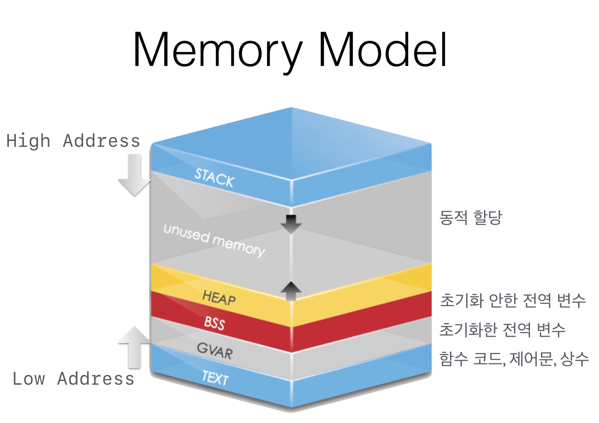

# Process

연속적으로 실행되고 있는 컴퓨터 프로그램

## 프로세스 메모리 공간

> 각 프로세스마다 별도의 주소 공간 할당

- Code(Text): 실행할 프로그램의 코드(명령어)
- Data: 프로그램의 전역 변수, 정적 변수
  - 프로그램의 시작과 함께 할당, 종료되면 소멸
  - 정확히는 초기화 되기 전엔 BSS에 저장, 초기화되면 Data 영역에 저장
- Heap: 사용자에 의해 동적으로 할당
  - FIFO(낮은 메모리 주소 → 높은 메모리 주소)
- Stack: 함수와 관계있는 지역 변수, 매개 변수, 리턴값 등
  - 함수 호출 시 할당, 반환 시 소멸
  - LIFO(높은 메모리 주소 → 낮은 메모리 주소)
  - thread마다 각각 할당

Stack 메모리와 Heap 메모리 사이에는 여유 공간이 있고, 런타임에 차례대로 주소값 할당

만약 Stack 메모리가 범위를 넘어가면 overflow 발생

## Multi Process

> 하나의 프로그램을 여러 프로세스로 구성

- 장점: 안정성
- 단점
  - 각각 메모리 영역 할당 → 작업량 많아지면 오버헤드 발생
  - Context Switching으로 인한 성능 저하

# 

# Thread

프로세스 안에서 실행되는 여러 흐름 단위

- 독립적으로 공간과 자원을 할당받는 process와는 달리, 다른 스레드와 공간과 자원을 공유

## Multi Thread

> 하나의 프로그램에서 여러 스레드 구성, 공유 메모리를 통해 다수의 작업 동시 처리

- 장점
  - 시간, 자원 손실 감소
  - 전역 변수와 정적 변수에 대한 공유
- 단점: 안정성
  - 메모리를 공유하기 때문에 하나의 스레드가 데이터를 망가뜨리면 모든 스레드가 작동 불가

## Critical Section(임계 구역)

> 공유 자원 접근 순서에 따라 실행 결과가 달라지는 코드 영역

- 임계 구역 안에서 공유 자원에 대한 경쟁(race) 발생
- 해결 조건
  - multi exclusion(상호 배제): 한 임계구역에는 하나의 프로세스
  - bounded waiting(한정 대기): 상호 배제로 인해 무한 대기 하지 않아야 한다
  - progress flexibility(진행의 융통성): 다른 프로세스의 진행을 방해하면 안된다

### references

- [프로세스 - 해시넷 (hash.kr)](http://wiki.hash.kr/index.php/%ED%94%84%EB%A1%9C%EC%84%B8%EC%8A%A4)
- [[OS] 프로세스와 스레드의 차이 - Heee's Development Blog (gmlwjd9405.github.io)](https://www.notion.so/OS-1-038a7e065de046d19aaed7a723026832)
- [[운영체제] 프로세스 메모리 구조 (velog.io)](https://velog.io/@cchloe2311/%EC%9A%B4%EC%98%81%EC%B2%B4%EC%A0%9C-%ED%94%84%EB%A1%9C%EC%84%B8%EC%8A%A4-%EB%A9%94%EB%AA%A8%EB%A6%AC-%EA%B5%AC%EC%A1%B0)
- [코딩의 시작, TCP School](http://www.tcpschool.com/c/c_memory_structure)
- [OS는 할껀데 핵심만 합니다. 8편 Critical section (임계 구역) (velog.io)](https://velog.io/@chappi/OS%EB%8A%94-%ED%95%A0%EA%BB%80%EB%8D%B0-%ED%95%B5%EC%8B%AC%EB%A7%8C-%ED%95%A9%EB%8B%88%EB%8B%A4.-8%ED%8E%B8-Critical-section-%EC%9E%84%EA%B3%84-%EA%B5%AC%EC%97%AD)
